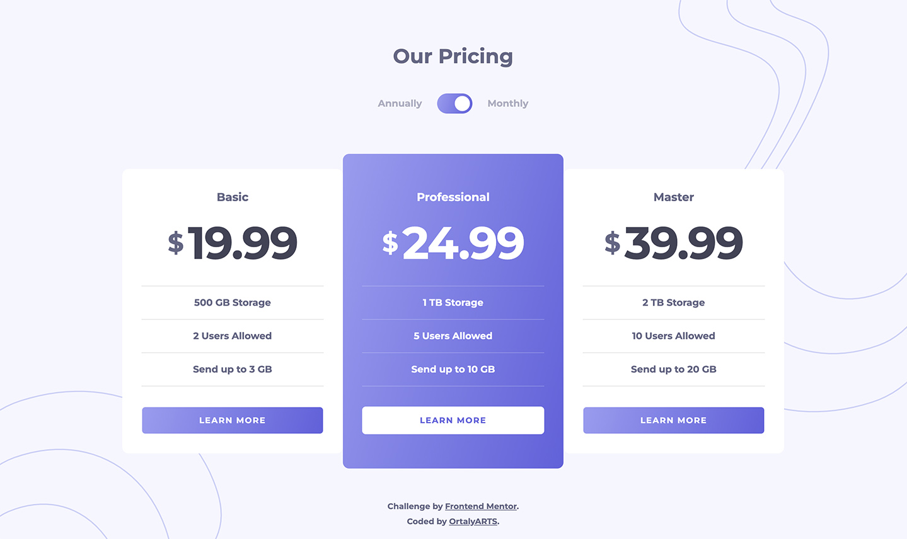

# Frontend Mentor - Pricing component with toggle solution

This is a solution to the [Pricing component with toggle challenge on Frontend Mentor](https://www.frontendmentor.io/challenges/pricing-component-with-toggle-8vPwRMIC). Frontend Mentor challenges help you improve your coding skills by building realistic projects. 

## Table of contents

- [Overview](#overview)
  - [The challenge](#the-challenge)
  - [Screenshot](#screenshot)
  - [Links](#links)
- [My process](#my-process)
  - [Built with](#built-with)
- [Author](#author)

**Note: Delete this note and update the table of contents based on what sections you keep.**

## Overview

### The challenge

Users should be able to:

- View the optimal layout for the component depending on their device's screen size
- Control the toggle with both their mouse/trackpad and their keyboard
- **Bonus**: Complete the challenge with just HTML and CSS

### Screenshot

### Links

- Solution URL: [View code](https://github.com/ortalyarts/frontendmentor-pricing-component-with-toggle)
- Live Site URL: [Preview Site](https://frontendmentor-pricing-component-with-toggle.vercel.app/)

### Built with

- Semantic HTML5 markup
- Native CSS
- Vanilla Javascript
- JSON to store the pack details
- fetch() to get and populate the data from JSON file
- CSS transition to animate switch toggle 
- Accessibility Techniques (checked with Chrome Screen Reader)
- PerfectPixel
- Lighthouse

## Author

- Website - [Add your name here](https://www.your-site.com)
- Frontend Mentor - [@yourusername](https://www.frontendmentor.io/profile/yourusername)
- Twitter - [@yourusername](https://www.twitter.com/yourusername)
